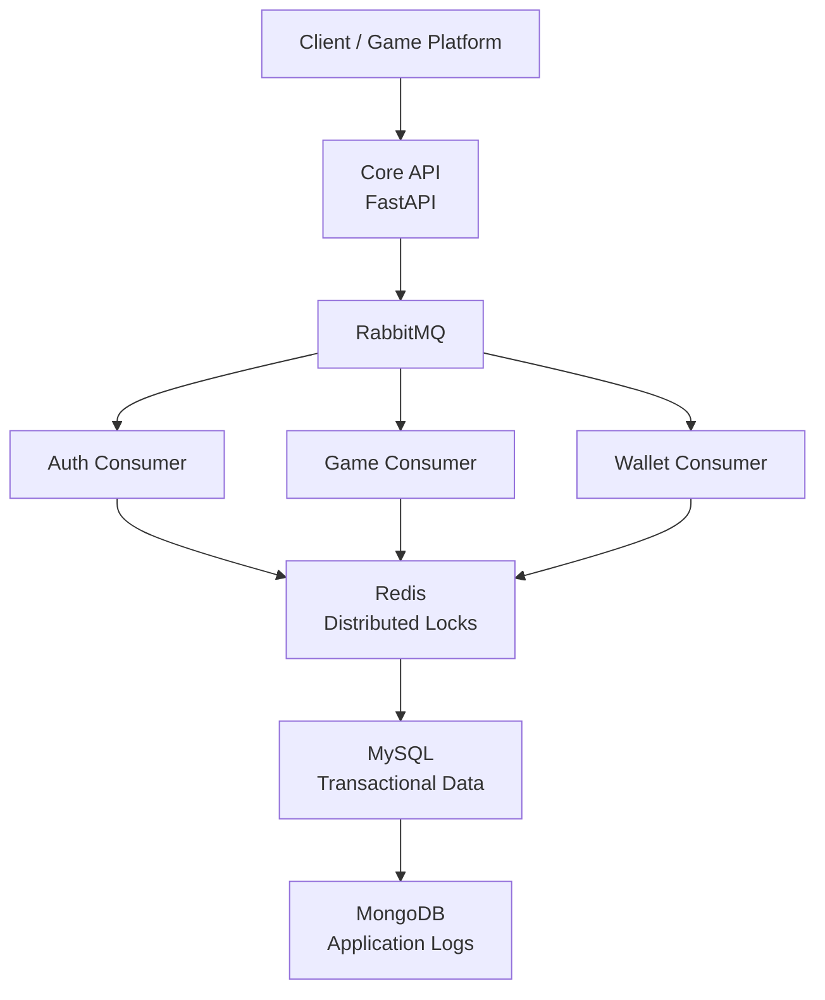
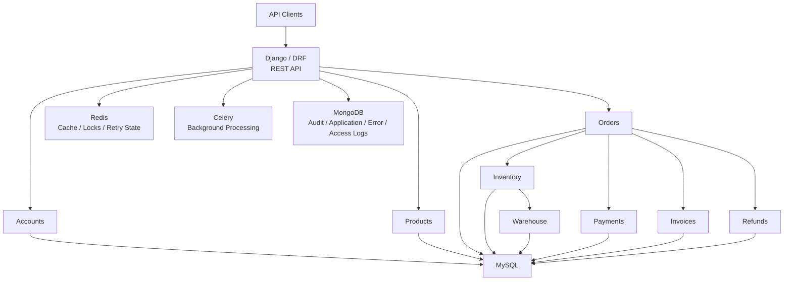
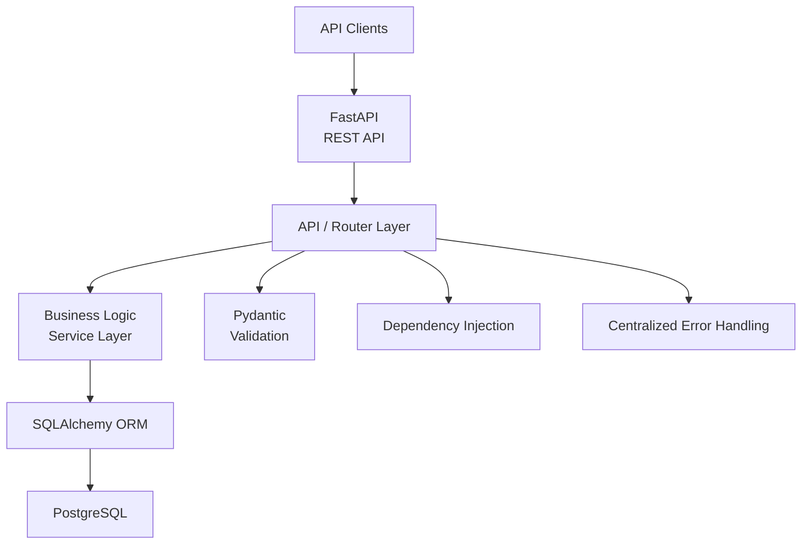

# Hi, I'm Soumajit Sarkar 👋

## Senior Python Backend Engineer

I build backend systems, REST APIs, and third-party integrations using **Python, Django, Django REST Framework, and FastAPI**.

My focus is on reliable backend engineering involving **transactional workflows, asynchronous processing, concurrency control, database design, external integrations, and scalable API architectures**.

---

## 🚀 What I Build

- High-throughput REST APIs
- Python backend systems with Django, DRF, and FastAPI
- Transaction-heavy business workflows
- Third-party API integrations
- Asynchronous processing with RabbitMQ and Celery
- Redis-based caching and distributed locking
- Relational database systems
- Modular monolith architectures
- Authentication and role-based authorization
- Background jobs and scheduled processing
- Logging, auditing, and error-handling workflows

---

# ⭐ Featured Projects

## 1. Plex Gaming Wallet Gateway

### Production Backend Integration Platform

A scalable backend integration gateway for online gaming platforms, handling **game launches, player balance operations, wallet debits/credits, transaction recovery, and provider callbacks**.

The platform integrates multiple gaming providers and client platforms while maintaining wallet consistency under concurrent requests.

### System Scale

| Metric | Approximate Scale |
| :--- | ---: |
| API throughput | 1,000–1,500 RPS |
| Transactions | 1M+ / month |
| Provider integrations | 60+ |
| Client platforms | 70+ |
| Games | Thousands |

### Architecture

### Key Engineering Areas

- Concurrent wallet transaction handling
- Redis distributed locking
- RabbitMQ-based asynchronous processing
- Gaming provider integrations
- Transaction tracking and recovery
- High-throughput API processing
- MySQL transactional data
- MongoDB application logging
- External API communication using HTTPX

### Technology

`Python` `FastAPI` `RabbitMQ` `Redis` `MySQL` `SQLAlchemy` `MongoDB` `HTTPX`

---

# 2. Enterprise Order Management System (OMS)

### Modular Enterprise Order Management Platform

An enterprise Order Management System designed around the complete order lifecycle, including **products, inventory, orders, payments, warehouses, invoices, refunds, notifications, reporting, and auditing**.

The system follows a **modular monolith architecture**, with business domains separated into dedicated Django applications while remaining within a single backend.

### Architecture

### Core Modules

- Authentication & Role-Based Access Control
- Department Management
- Product Management
- Inventory Management
- Order Management
- Payment Management
- Warehouse Management
- Invoice Management
- Refund Management
- Notification Management
- Reporting
- Audit Logging

### Key Engineering Areas

- Modular monolith architecture
- Transactional order processing
- Inventory consistency and concurrency control
- Redis-based distributed locking
- Celery background processing
- Payment and refund workflows
- Invoice and notification processing
- Audit and application logging
- MySQL relational data management

### Technology

`Python` `Django` `Django REST Framework` `MySQL` `Redis` `Celery` `MongoDB` `Docker` `Swagger / OpenAPI`

---

# 3. Enterprise Management System (EMS)

### FastAPI + PostgreSQL Backend System

An enterprise management backend built with **FastAPI and PostgreSQL**, focused on structured REST APIs, relational data modeling, validation, business logic separation, and maintainable backend architecture.

### Architecture

### Key Engineering Areas

- FastAPI REST API development
- PostgreSQL database design
- SQLAlchemy-based persistence
- Pydantic request/response validation
- API and business-logic separation
- Dependency injection
- Centralized error handling
- Environment-based configuration
- OpenAPI documentation
- Automated testing with pytest
- Production deployment preparation

### Technology

`Python` `FastAPI` `PostgreSQL` `SQLAlchemy` `Pydantic` `pytest` `OpenAPI`

---

# 🧠 Backend Engineering Focus

### API Design

Designing REST APIs with clear resource boundaries, validation, consistent error handling, pagination, filtering, and API documentation.

### Database Design

Designing relational schemas, relationships, constraints, indexes, transactions, and query patterns for business-critical applications.

### Concurrency

Handling race conditions in transaction-heavy systems using database transactions, locking strategies, and Redis-based distributed locks.

### Asynchronous Processing

Designing background workflows using RabbitMQ and Celery where asynchronous processing improves reliability, scalability, or responsiveness.

### Integrations

Building reliable integrations with external APIs and adapting provider-specific protocols into consistent internal business workflows.

### Reliability

Designing for retries, idempotency, transaction recovery, failure handling, logging, and data consistency.

---

# 🛠️ Technical Stack

### Languages

`Python` `SQL`

### Backend

`Django` `Django REST Framework` `FastAPI` `SQLAlchemy`

### Databases

`MySQL` `PostgreSQL` `MongoDB`

### Distributed & Async

`Redis` `RabbitMQ` `Celery`

### API & Integration

`REST APIs` `HTTPX` `OpenAPI` `Swagger`

### Development & Deployment

`Git` `GitHub` `Docker` `Linux`

---

# 📌 Engineering Principles

- Clear separation of concerns
- Modular architecture
- Explicit business logic
- Strong database integrity
- Idempotent and retry-safe workflows
- Proper transaction boundaries
- Defensive error handling
- Meaningful application logging
- Simple architectures before unnecessary microservices
- Maintainable code and clear domain boundaries

---

# 📫 Let's Connect

I'm interested in backend engineering projects involving:

- Python backend development
- Django / DRF applications
- FastAPI services
- REST API development
- Third-party API integrations
- Transaction-heavy systems
- Backend architecture and modernization

**Open to full-time opportunities and international freelance backend projects.**

---

### GitHub

[github.com/soumajit-sarkar](https://github.com/soumajit-sarkar)
